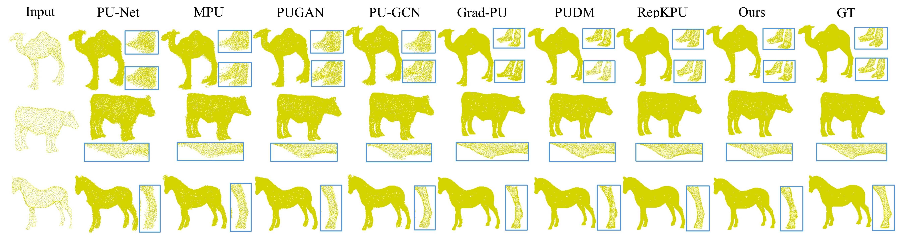
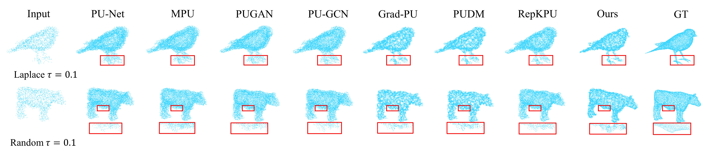
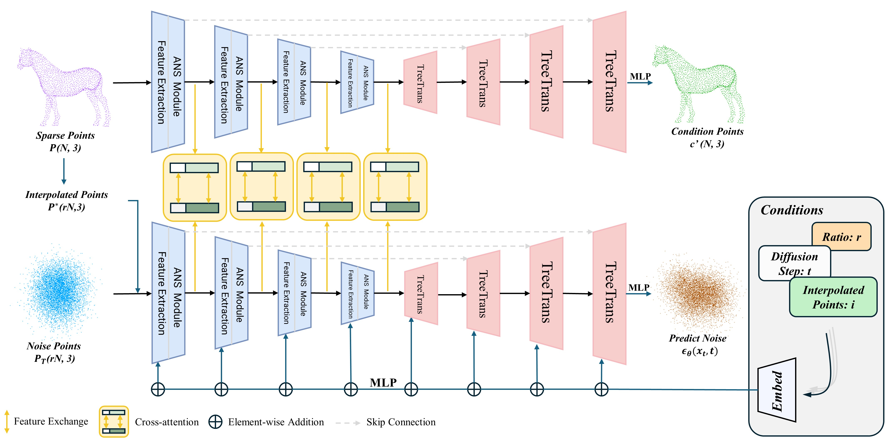

# PDANS: Point Cloud Upsampling with Conditional Diffusion and Adaptive Noise Suppression

[](https://pytorch.org/)
[](https://www.python.org/)
[](https://developer.nvidia.com/cuda-toolkit)
[](https://opensource.org/licenses/MIT)

This is the official PyTorch implementation for the paper **[Point Cloud Upsampling Using Conditional Diffusion Module with Adaptive Noise Suppression (CVPR 2025)](https://github.com/Baty2023/PDANS)**.

## Highlights

- **Superior Noise Robustness**: Our PDANS significantly outperforms current state-of-the-art (SOTA) methods in handling Gaussian, random, and Laplacian noise.
- **High-Quality Geometric Detail Recovery**: PDANS is capable of generating point clouds with clear structures and rich details, even in large upsampling factor tasks like 16x.
- **Advanced Module Design**: Our innovative **Adaptive Noise Suppression (ANS)** and **Tree-Trans (TT)** modules synergistically enhance feature extraction and noise suppression capabilities.

<p align="center">
  

  <em>Figure 1: Visual comparison of 16x upsampling on the PUGAN dataset.</em>
</p>
<p align="center">
  

  <em>Figure 2: Robustness comparison with noisy inputs (Gaussian noise τ=0.1).</em>
</p>

## Table of Contents
- [Overall Framework](#overall-framework)
- [Environment Setup](#environment-setup)
- [Data Preparation](#data-preparation)
- [Quick Start: Training & Evaluation](#quick-start-training--evaluation)
- [Model Zoo](#model-zoo)
- [Acknowledgements](#acknowledgements)
- [Citation](#citation)

## Overall Framework

PDANS consists of a Conditional Point Cloud Network (CP-Net) and a Diffusion Point Cloud Network (DP-Net). Our designed ANS and TT modules serve as the core components of the encoder and decoder, respectively. They interact via a cross-network attention mechanism to collectively achieve robust and high-quality point cloud upsampling.

<p align="center">
  
</p>

## Environment Setup

We recommend using an NVIDIA 4080 GPU or higher and running this project in the following environment:
- **OS**: Ubuntu 22.04+
- **CUDA**: 11.8+
- **PyTorch**: 2.0.0+
- **Python**: 3.8+

**Detailed Installation Steps:**

1.  **Clone this repository**
    ```bash
    git clone https://github.com/Baty2023/PDANS.git
    cd PDANS
    ```

2.  **Create and activate a virtual environment using Conda**
    ```bash
    conda create -n pdans python=3.8 -y
    conda activate pdans
    ```

3.  **Install core dependencies (PyTorch)**
    ```bash
    # Install PyTorch matching CUDA 11.8 using conda
    conda install pytorch==2.0.0 torchvision==0.15.0 torchaudio==2.0.0 pytorch-cuda=11.8 -c pytorch -c nvidia
    ```

4.  **Install other Python packages**
    ```bash
    pip install -r requirements.txt
    ```

5.  **Install PyTorch3D**
    As compiling PyTorch3D can be complex, we recommend downloading a pre-compiled package from Anaconda Cloud.
    ```bash
    # 1. Visit https://anaconda.org/pytorch3d/pytorch3d/files
    #    and find a version that matches your environment (e.g., pytorch3d-0.7.4-py38_cu118_pyt200.tar.bz2)
    # 2. After downloading the file, install it locally using conda
    conda install /path/to/your/downloaded/pytorch3d-xxxx.tar.bz2
    ```
    If you cannot find a perfectly matching version, please refer to the official [PyTorch3D Installation Guide](https://github.com/facebookresearch/pytorch3d/blob/main/INSTALL.md) to compile from source.

6.  **Compile Custom C++/CUDA Extensions**
    Our code uses some custom CUDA operations (e.g., Chamfer Distance, KNN) to improve efficiency, which need to be compiled manually.
    ```bash
    sh compile.sh
    ```
    If the compilation is successful, you should not see any error messages.

## Data Preparation

We conducted experiments on the **PUGAN** and **PU1K** datasets and provide the download links:

1.  **Download Datasets**
    - Download the PUGAN dataset from [Google Drive](https://drive.google.com/open?id=1BNqjidBVWP0_MUdMTeGy1wZiR6fqyGmC).
    - Download the PU1K dataset from [Google Drive](https://drive.google.com/open?id=1oTAx34YNbL6GDwHYL2qqvjmYtTVWcELg).

## Quick Start: Training & Evaluation

We provide simple scripts to start the training and evaluation process.

### Training

Use the following command to start a 4x upsampling training task on the PU1K dataset:

```bash
python ./pointnet2/train.py -d PU1K
```

- `--config`: Specifies the configuration file for the model and training parameters.
- `--exp_name`: The name for this experiment. All logs, model weights, and visualization results will be saved in the `outputs/pdans_pugan_x4` directory.

### Evaluation

Use the following command to evaluate a pre-trained model on the PUGAN test set with Gaussian noise (`τ=0.05`):

```bash
python ./pointnet2/samples.py --dataset=PUGAN --R=5 --step=30 --batch_size=15
```

- `--dataset`: Specifies the dataset, either PUGAN or PU1K.
- `--R`: Upsampling ratio.
- `--step`: Number of sampling steps.

## Model Zoo

We provide pre-trained models on PUGAN and PU1K to facilitate the reproduction of our paper's results.

| Dataset | Upsampling Ratio | CD (x10⁻³) | HD (x10⁻³) | P2F (x10⁻³) | Download Link |
| :---: | :---: | :---: | :---: | :---: | :---: |
| PUGAN | 4x | **0.119** | **1.206** | 1.897 | [Link_to_PUGAN_4x_model.pth]() |
| PU1K | 4x | **0.155** | **1.588** | 1.354 | [Link_to_PU1K_4x_model.pth]() |

*Note: Model links will be provided after the code is fully open-sourced.*

## Acknowledgements

Our work was inspired and aided by the following excellent research:
- [PUDM](https://github.com/Wentao-Qu/PUDM)
- [Grad-PU](https://github.com/yindan-zhang/Grad-PU)
- [PointNet++](https://github.com/charlesq34/pointnet2)

Additionally, some of our custom CUDA code is based on [Pytorch-Pointnet2](https://github.com/erikwijmans/Pointnet2_PyTorch). We express our sincere gratitude to these authors for their open-source contributions!

## Citation

If you find our work helpful for your research, please consider citing our paper:

```bibtex
@InProceedings{Zhang_2025_CVPR,
    author    = {Zhang, Boqian and Yang, Shen and Chen, Hao and Yang, Chao and Jia, Jing and Jiang, Guang},
    title     = {Point Cloud Upsampling Using Conditional Diffusion Module with Adaptive Noise Suppression},
    booktitle = {Proceedings of the IEEE/CVF Conference on Computer Vision and Pattern Recognition (CVPR)},
    month     = {June},
    year      = {2025},
    pages     = {16987-16996}
}
```